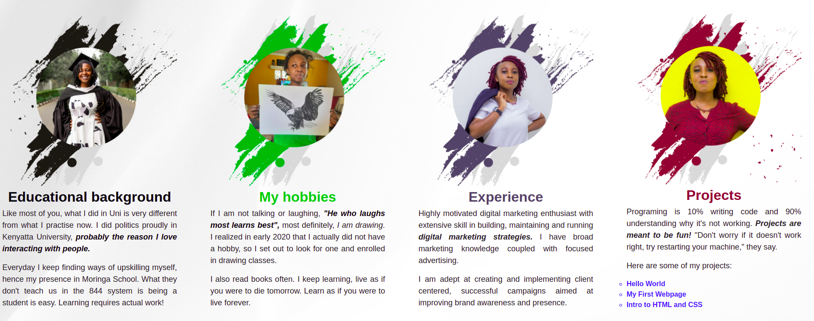

# charmains-first-ip

This is going to be a brief description of the landing page that showcases my portfolio.
### By Charmain Bonareri, 25/02/2022



## Table of contents
* [Description](#description)
* [Setup and Installation Requirements](#setup)
* [Technologies](#technologies)
* [How it Works](#instructions)
* [Licence](#licence)
* [Authors information](#contact)

## Description
<p>This is my first portfolio website that provides information about my professional competencies and showcases my work. It contains an about me section which describes who I am in depth, an education background section where you can see what I studied and the institutions I have attended, a hobbies section that outlines my passions and what I do often during my free time. There is also a section that shows some of the projects I have done and lastly my contact information.</p>
	
## Setup and Installation Requirements
To run this program:

```
$ Fork the repository from my git hub.
$ Clone the project to your local machine.
$ Run the code from VS Code through a liveserver to chrome browser.
$ Make changes where need be.
```

## Technologies
* HTML - HTML is the standard markup language for Web pages.
* CSS - CSS is the language we use to style an HTML document.
* Java Script - JavaScript is the programming language of the Web.


# Licence
MIT Licence 
copyright (c) 2022 Charmain Bonareri. All Rights Reserved.

## Authors information
Contributions are always welcome! 
If you have any questions,comments or correctional advice,feel free to contact me
* Email: mogerecharmain@gmail.com
* [LinkedIn](https://www.linkedin.com/in/charmain-bonareri-71a209126/)